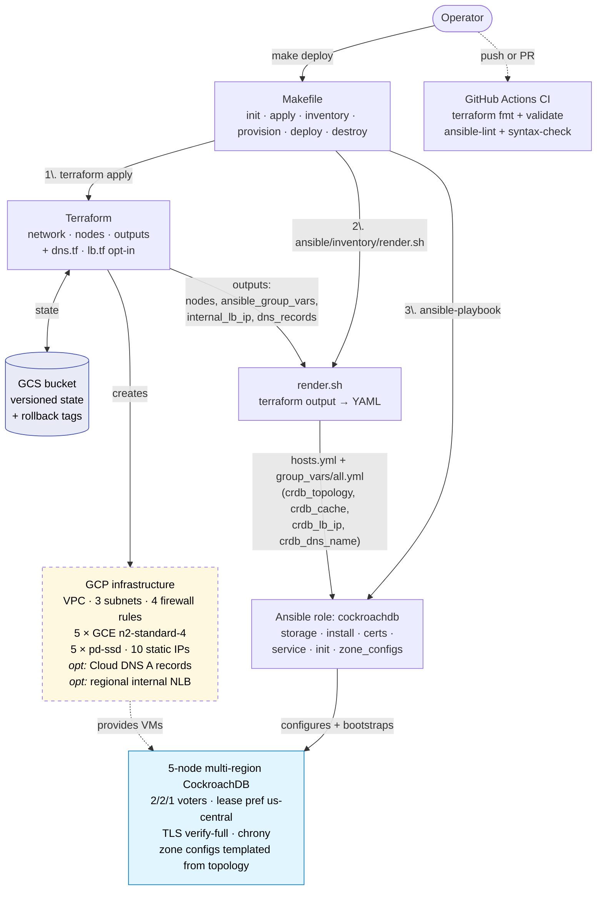

# Self-Hosted CockroachDB on GCE: A Multi-Region Terraform Blueprint

> A pragmatic Terraform scaffold for a 5-node, 3-region, secure CockroachDB cluster on Google Compute Engine — wired up with the exact zone configurations you actually want in production.

## Why this project exists

If you go looking for "Terraform for self-hosted CockroachDB on GCE," you will not find much. The CockroachDB repo ships Terraform under `pkg/roachprod/vm/aws/terraform/`, but that targets AWS. The GCE side of `roachprod` is implemented in Go (`pkg/roachprod/vm/gce`) and lives behind the `roachprod` CLI — it is not a piece of infrastructure-as-code you can drop into your own pipeline. The official `cockroachdb/cockroach` Terraform provider is for **CockroachDB Cloud**, not self-hosted instances.

So if you want a self-hosted CRDB cluster on GCE, multi-region, secure-by-default, with declarative zone configs applied at apply-time — you build it. This repo is that build.

## The target topology

We want survivability across three geographic regions: Chicago-ish, Ashburn, and Ohio. GCP's nearest mappings are `us-central1` (Iowa), `us-east4` (Ashburn VA), and `us-east5` (Columbus OH). Five nodes, distributed 2/2/1, exactly matching the voter constraints in the zone config.

| Locality label (in CRDB) | GCP region | Zones used        | Nodes |
| ------------------------ | ---------- | ----------------- | ----- |
| `us-central`             | us-central1 | `us-central1-a`, `us-central1-b` | 2 |
| `us-east-1`              | us-east4    | `us-east4-a`, `us-east4-b`       | 2 |
| `us-east-2`              | us-east5    | `us-east5-a`                     | 1 |


Note: the CRDB `--locality` labels (`us-central`, `us-east-1`, `us-east-2`) are deliberately distinct from the GCP region names. The zone configs key on the CRDB labels, and we wire those labels at `cockroach start` time via `--locality=cloud=gce,region=<label>,zone=<gce-zone>`.

## Design decisions and the trade-offs behind them

**Region choice.** `us-central1` is the closest GCP region to Chicago (Council Bluffs, Iowa is ~500km from downtown). `us-east4` is Ashburn — the obvious pick. `us-east5` is Columbus, Ohio — newer than `us-east1` but it's the only GCP region actually in Ohio. If you hit `us-east5` quota or capacity issues, `us-east1` (Moncks Corner SC) is a reasonable fallback at the cost of a bit more inter-region latency.

**Why exactly 5 nodes.** With 5 replicas split 2/2/1 across regions, 5 nodes is the minimum that the voter constraint can satisfy. It is not the most resilient — losing any single node in `us-central` or `us-east-1` costs you a voter — but it is the cheapest correct configuration. Scale to 3 nodes per region (9 total) when you want headroom for rolling restarts and zone failures without losing voters.

**Secure by default.** Insecure mode is fine for ten-minute repros, but a multi-region cluster traversing the public internet between GCE regions is not the place to skip TLS. We generate a CA, per-node certs, and a root client cert locally with the `cockroach cert` CLI, then SCP them onto each VM before `cockroach start` is allowed to begin.

**Machine sizing baseline.** `n2-standard-4` with a 250GB `pd-ssd` boot disk matches what `roachprod` reaches for as a sane default (`pkg/roachprod/vm/gce/gcloud.go`). It's enough to run the full `tpcc` workload at low warehouse counts and exercise the cluster for correctness work. Bump to `n2-standard-8`/`n2-standard-16` and 1TB+ for sustained production load — both are single variable changes.

**No load balancer.** We expose per-node IPs as Terraform outputs and let you wire the connection string yourself. A regional internal TCP LB is the right answer once you have a real application topology and care about not pinning clients to specific nodes — but it adds resources, an interaction with health checks, and another knob to tune. Start without; add when you need it.

## Architecture walkthrough

Two halves with a clean seam:

- **Terraform** owns infra: VPC, subnets, firewalls, static IPs, data disks, VMs. That's it.
- **Ansible** owns everything inside the VMs: storage formatting, CRDB install, TLS certs, systemd, cluster init, zone-config apply.


The five tiers above:

1. **Entry points & initiation** — `make deploy` is the single operator entry point; the Makefile fans out to terraform, render.sh, and ansible-playbook in sequence. Push or PR triggers GitHub Actions CI for static checks.
2. **Provisioning & infrastructure** — Terraform creates the GCP infrastructure (VPC, subnets, firewall rules, 5 GCE VMs, pd-ssd disks, static IPs); state lives in a versioned GCS bucket. `dns.tf` and `lb.tf` add Cloud DNS records and a regional internal NLB when their gating variables are set.
3. **Inventory rendering** — `ansible/inventory/render.sh` reads Terraform outputs and emits the Ansible inventory (`hosts.yml`) plus `group_vars/all.yml` (carrying `crdb_topology`, `crdb_cache`, `crdb_lb_ip`, `crdb_dns_name`).
4. **Deployment & configuration** — the `cockroachdb` Ansible role runs storage → install → certs → service → init → zone_configs against the inventory.
5. **Target cluster & persistent state** — a 5-node multi-region cluster with the topology-driven zone configs, TLS verify-full, and chrony for clock skew.

The same flow as a Mermaid diagram (kept editable in the README source — GitHub renders it natively):



Bring-up order:

1. **Network** (`terraform apply`): a global VPC with auto-subnets disabled, one `/24` subnet per region, and four firewall rules:
   - `allow-internal`: `26257` + `8080` between the three regional CIDRs (gossip + cross-region admin UI)
   - `allow-ssh`: `22` from `var.admin_cidrs` (Ansible needs SSH)
   - `allow-admin-ui`: `8080` from `var.admin_cidrs`
   - `allow-sql-external`: `26257` from `var.admin_cidrs` — optional now (Ansible runs SQL on the first node), kept so you can still drive `cockroach sql` from your laptop if you want.
2. **Static IPs** (`terraform apply`): 5 internal + 5 external `google_compute_address` reservations created *before* the VMs, so Ansible can build the `--join` string deterministically.
3. **VMs** (`terraform apply`): five `google_compute_instance` resources via `for_each` over a node map (region, zone, locality label). Each gets a 250 GB `pd-ssd` data disk. No startup script — the GCE guest agent provisions the SSH user from instance metadata, and Ansible takes over from there.
4. **Inventory render** (`make inventory`): `ansible/inventory/render.sh` reads `terraform output -json nodes` and emits `ansible/inventory/hosts.yml` with one entry per node, carrying `ansible_host` (external IP), `private_ip`, `crdb_locality_label`, and `crdb_gce_zone`.
5. **Storage + install** (`make provision` → role tasks `storage.yml`, `install.yml`): formats `/dev/disk/by-id/google-crdb-data` if needed, mounts at `/mnt/data1`, installs `chrony` (CRDB requires <500ms clock skew), creates the `cockroach` user, downloads the pinned CRDB tarball, installs the binary to `/usr/local/bin/cockroach`.
6. **Certs** (role task `certs.yml`): on the first node, generates a CA via `cockroach cert create-ca`; fetches `ca.crt` + `ca.key` back to the controller (`ansible/certs/`, gitignored) as the durable source of truth. Pushes the CA to every node, generates per-node certs in place (SANs: internal IP, external IP, `crdb-<id>`, `localhost`, `127.0.0.1`), generates the root client cert on the first node and distributes it. Removes the CA key from non-first nodes. **Mismatch guard**: if the controller CA is missing but any node already has a `node.crt`, the play aborts loudly rather than silently rotating to a new CA that would break TLS on the next restart.
7. **Service** (role task `service.yml`): renders `cockroach.service` from a Jinja template (with `--locality=cloud=gce,region=<label>,zone=<gce-zone>` per host, `ConditionPathExists=node.crt`, `--join` built from inventory), enables and starts it, waits for the SQL port to accept connections.
8. **Init** (role task `init.yml`): runs `cockroach init` once on the first node, idempotent via the `/var/lib/cockroach/.bootstrapped` marker file plus a substring match on the "already initialized" stderr in case the marker is missing.
9. **Zone configs** (role task `zone_configs.yml`): waits for all expected nodes to register (polls `count(*) FROM crdb_internal.kv_node_status`), renders `sql/zone-configs.sql.j2` from `crdb_topology` (sourced from `terraform output ansible_group_vars`) so `num_replicas`, `voter_constraints`, and `lease_preferences` track the live topology, then runs `cockroach sql --file=…` against the rendered file. All `ALTER … CONFIGURE ZONE` statements are idempotent.

## Repo layout

```
terraform-crdb-gcp/
├── README.md                # this file
├── TESTING.md               # tiered testing strategy
├── Makefile                 # init/plan/apply/inventory/provision/deploy/destroy/clean
├── .gitignore
├── versions.tf              # terraform + google + null + local provider pins
├── providers.tf             # google provider, project from var.project_id
├── variables.tf             # project_id, admin_cidrs, machine_type, disk sizes, ...
├── network.tf               # VPC, 3 regional subnets, 4 firewall rules
├── nodes.tf                 # static IPs + data disks + 5 google_compute_instance
├── outputs.tf               # node IPs, admin UI URL, structured `nodes` output for inventory
├── terraform.tfvars.example # template — copy to terraform.tfvars
├── ansible/
│   ├── ansible.cfg
│   ├── playbooks/site.yml
│   ├── inventory/
│   │   ├── render.sh        # generates hosts.yml from terraform outputs
│   │   └── hosts.yml        # generated; gitignored
│   ├── certs/               # generated CA + root client cert; gitignored
│   └── roles/cockroachdb/
│       ├── defaults/main.yml
│       ├── handlers/main.yml
│       ├── templates/cockroach.service.j2
│       └── tasks/{main,storage,install,certs,service,init,zone_configs}.yml
└── sql/
    └── zone-configs.sql     # the multi-region zone configs (Antigena line is TODO)
```

## The zone configs

The whole reason this repo is shaped the way it is. After init, we apply the following SQL — these are the configs that produce the 2/2/1 voter layout with `us-central` holding the lease preference:

```sql
ALTER DATABASE system CONFIGURE ZONE USING
    range_min_bytes = 134217728,
    range_max_bytes = 536870912,
    gc.ttlseconds = 90000,
    num_replicas = 5,
    num_voters = 5;

ALTER RANGE default CONFIGURE ZONE USING
    range_min_bytes = 134217728,
    range_max_bytes = 536870912,
    gc.ttlseconds = 14400,
    num_replicas = 5,
    num_voters = 5,
    constraints = '{+region=us-central: 2, +region=us-east-1: 2, +region=us-east-2: 1}',
    voter_constraints = '{+region=us-central: 2, +region=us-east-1: 2, +region=us-east-2: 1}',
    lease_preferences = '[[+region=us-central], [+region=us-east-1], [+region=us-east-2]]';

ALTER RANGE liveness CONFIGURE ZONE USING
    range_min_bytes = 134217728, range_max_bytes = 536870912,
    gc.ttlseconds = 600, num_replicas = 5, num_voters = 5;

ALTER RANGE meta CONFIGURE ZONE USING
    range_min_bytes = 134217728, range_max_bytes = 536870912,
    gc.ttlseconds = 3600, num_replicas = 5, num_voters = 5;

ALTER RANGE system CONFIGURE ZONE USING
    range_min_bytes = 134217728, range_max_bytes = 536870912,
    gc.ttlseconds = 90000, num_replicas = 5, num_voters = 5;

ALTER RANGE timeseries CONFIGURE ZONE USING gc.ttlseconds = 14400;

-- TODO: the original ALTER TABLE statement here had its identifier rewritten
-- by an Antigena URL proxy. Replace with the real table name before applying.
-- ALTER TABLE <real.table.name> CONFIGURE ZONE USING gc.ttlseconds = 3600;

ALTER TABLE system.public.replication_constraint_stats CONFIGURE ZONE USING
    range_min_bytes = 134217728, range_max_bytes = 536870912,
    gc.ttlseconds = 600, num_replicas = 5, num_voters = 5;

ALTER TABLE system.public.replication_stats CONFIGURE ZONE USING
    range_min_bytes = 134217728, range_max_bytes = 536870912,
    gc.ttlseconds = 600, num_replicas = 5, num_voters = 5;

ALTER TABLE system.public.span_stats_tenant_boundaries CONFIGURE ZONE USING gc.ttlseconds = 3600;
ALTER TABLE system.public.statement_activity         CONFIGURE ZONE USING gc.ttlseconds = 3600;
ALTER TABLE system.public.statement_statistics       CONFIGURE ZONE USING gc.ttlseconds = 3600;
ALTER TABLE system.public.transaction_activity       CONFIGURE ZONE USING gc.ttlseconds = 3600;
ALTER TABLE system.public.transaction_statistics     CONFIGURE ZONE USING gc.ttlseconds = 3600;
```

> One of the `ALTER TABLE` statements in the source had its identifier replaced by a security-proxy rewriting URL (`https://us01.l.antigena.com/...`). It is left commented out with a TODO — restore the real table name before running for real.

## Quickstart

Prerequisites (all on the machine running `make deploy`):

- `terraform` >= 1.6
- `ansible` >= 2.15 (`pip install ansible` or `brew install ansible`)
- `jq` (used by `inventory/render.sh`)
- `gcloud` CLI authenticated with Application Default Credentials: `gcloud auth application-default login`
- A GCP project with billing enabled and the Compute Engine API turned on (`gcloud services enable compute.googleapis.com`)
- An SSH keypair (defaults to `~/.ssh/id_ed25519` / `~/.ssh/id_ed25519.pub`)
- **No `cockroach` CLI required** on the operator machine — Ansible runs cert generation and SQL on the first node.

Run, in order:

**1. Variables.** Copy the example tfvars (only if it doesn't already exist — `-n` is no-clobber so re-running the quickstart won't wipe your customized file):

```bash
cp -n terraform.tfvars.example terraform.tfvars
```

Open `terraform.tfvars` and set `project_id`, `admin_cidrs` (your `/32` at minimum), and `ssh_pubkey_path` (the example default is `~/.ssh/id_ed25519.pub` — change this if your key is at a different path). The placeholders (`my-gcp-project-id`, `1.2.3.4/32`) will fail at plan time with confusing errors, so don't skip the edit.

**2. Remote state (recommended).** Create a versioned GCS bucket for Terraform state and point Terraform at it. Skip this and Terraform falls back to local state — fine for demos, risky for anything you'll come back to.

```bash
PROJECT_ID=cockroach-ali make bootstrap-state
cp -n backend.hcl.example backend.hcl
```

Open `backend.hcl` and replace `<your-project-id>` with your actual project ID. The result should look like:

```hcl
bucket = "cockroach-ali-tfstate-crdb"
prefix = "crdb-cluster"
```

**3. Deploy.**

```bash
make init
make deploy
```

`make deploy` runs `terraform apply`, renders the Ansible inventory, and runs the playbook — about 10 min on the default 5-node topology.

What `make deploy` produces:

- VPC + 3 regional subnets + 4 firewall rules
- 5 static internal + 5 static external IPs
- 5 GCE VMs with `chrony` and `cockroach` installed and a 250 GB `pd-ssd` data disk mounted at `/mnt/data1`
- `ansible/certs/` (gitignored) on the operator machine containing CA + root client cert
- `ansible/inventory/hosts.yml` (gitignored) for re-runs
- A live, initialized 5-node multi-region cluster with the zone configs applied

Useful outputs:

```bash
terraform output node_external_ips
terraform output node_internal_ips
terraform output admin_ui_url
terraform output -raw sql_connection_string_root
```

(`sql_connection_string_root` is marked `sensitive`; that's why it needs `-raw`.)

Re-running the playbook on its own:

```bash
make provision
make provision EXTRA="--tags certs"
make provision-check
```

`make provision` runs the full role; `EXTRA` passes through to `ansible-playbook` (e.g., `--tags certs` re-runs only the cert tasks); `make provision-check` is a `--check --diff` dry-run.

## Verification

> For a fuller testing strategy — static checks, SQL sanity tests, plan-time checks, real-apply verification, failure-injection — see [TESTING.md](./TESTING.md).

```bash
N1=$(terraform output -json node_external_ips | jq -r '.n1')

# 5 nodes live, three distinct localities (us-central / us-east-1 / us-east-2)
ssh crdb@$N1 "sudo -u cockroach /usr/local/bin/cockroach node status \
  --certs-dir=/var/lib/cockroach/certs --host=localhost"

# Confirm the zone config landed correctly (run on a node — no laptop CLI needed)
ssh crdb@$N1 "sudo -u cockroach /usr/local/bin/cockroach sql \
  --certs-dir=/var/lib/cockroach/certs --host=localhost \
  -e 'SHOW ZONE CONFIGURATION FROM RANGE default'"

# Quick functional smoke test (also from the node)
ssh crdb@$N1 "sudo -u cockroach /usr/local/bin/cockroach workload init kv \
  'postgresql://root@localhost:26257?sslmode=verify-full&sslrootcert=/var/lib/cockroach/certs/ca.crt&sslcert=/var/lib/cockroach/certs/client.root.crt&sslkey=/var/lib/cockroach/certs/client.root.key'"
```

### CA lifecycle

The CA cert and key live at `ansible/certs/{ca.crt,ca.key}` on the operator machine and are the durable source of truth.

- `terraform destroy` does **not** remove them. Recreating a cluster reuses the same CA, so existing client cert material continues to work.
- `make clean-ca` deletes `ansible/certs/` and forces a fresh CA on the next `make provision`. Use this when you actually want to rotate.
- If `ansible/certs/` is missing but VMs already have node certs from a previous deploy, the certs play **aborts loudly** rather than silently regenerating a mismatched CA.

## Configuration

Defaults reproduce the canonical 5-node 2/2/1 multi-region setup. All knobs below are optional — set in `terraform.tfvars` or pass via `-var`.

### Required

| Variable | Description |
|---|---|
| `project_id` | GCP project where the cluster runs. |
| `admin_cidrs` | Source CIDRs allowed for SSH (Ansible) and admin UI access. Use a `/32` or your VPN CIDR. |

### Common (optional)

| Variable | Default | Description |
|---|---|---|
| `ssh_user` | `crdb` | Linux user provisioned via instance metadata. |
| `ssh_pubkey_path` | `~/.ssh/id_ed25519.pub` | Public key installed on each VM. |
| `machine_type` | `n2-standard-4` | GCE shape per node. |
| `boot_disk_size_gb` | `50` | OS disk size. |
| `data_disk_size_gb` | `250` | CRDB store disk (`pd-ssd`). |
| `network_name` | `crdb` | Prefix for VPC + firewall + IP names. |
| `crdb_cache` | `.25` | `--cache=` fraction of node RAM. |
| `crdb_max_sql_memory` | `.25` | `--max-sql-memory=` fraction. Sum with cache should stay ≤0.8. |

CRDB version is set in `ansible/roles/cockroachdb/defaults/main.yml` (`crdb_version: v25.4.0`). Override at provision time with `make provision EXTRA="-e crdb_version=vX.Y.Z"`.

### Topology (optional)

`var.topology` controls cluster size, region selection, and per-region zone spread. The default produces 5 nodes 2/2/1 across `us-central1`, `us-east4`, `us-east5`. To change shape, override the whole map. Node ordinals (`n1..nN`) are assigned by walking the map in sorted-key order.

```hcl
# 9-node 3/3/3 multi-region:
topology = {
  "us-central" = { region = "us-central1", cidr = "10.10.0.0/24",
                   locality_label = "us-central",
                   zones = ["us-central1-a","us-central1-b","us-central1-c"], node_count = 3 }
  "us-east-1"  = { region = "us-east4",    cidr = "10.20.0.0/24",
                   locality_label = "us-east-1",
                   zones = ["us-east4-a","us-east4-b","us-east4-c"], node_count = 3 }
  "us-east-2"  = { region = "us-east5",    cidr = "10.30.0.0/24",
                   locality_label = "us-east-2",
                   zones = ["us-east5-a","us-east5-b","us-east5-c"], node_count = 3 }
}
```

The zone-config SQL (`sql/zone-configs.sql.j2`) is a Jinja template — `num_replicas`, `num_voters`, `constraints`, `voter_constraints`, and `lease_preferences` are derived from `var.topology` at provision time. Changing the topology no longer requires hand-editing the SQL. Lease-preference order follows sorted topology keys (default: `us-central` > `us-east-1` > `us-east-2`); rename your localities if you want a different priority.

### DNS (opt-in)

Set `dns_managed_zone` to an existing `google_dns_managed_zone` in your project to get per-node A records and a round-robin `crdb-any.<zone>` record. The FQDNs are automatically added to each node's TLS cert SANs, so clients can connect with `sslmode=verify-full` against the hostname.

```hcl
dns_managed_zone     = "my-public-zone"
dns_name_template    = "crdb-{n}.cluster.example.com."   # trailing dot required
dns_use_internal_ips = false   # true for private zones
```

`terraform output dns_records` lists the FQDNs once created.

### Internal load balancer (opt-in)

A regional internal TCP NLB in front of the SQL port, backed by all nodes in a single region. Lets in-VPC clients connect to one VIP instead of pinning to a node.

```hcl
create_internal_lb = true
internal_lb_region = "us-central1"   # must be one of var.topology[*].region
```

`terraform output internal_lb_ip` exposes the VIP. From a node:

```bash
cockroach sql --certs-dir=/var/lib/cockroach/certs --host=<LB_IP>:26257 -e 'SELECT 1'
```

External LB and a load-balancer-aware DNS record are not in scope today.

## Roadmap / out of scope

What this repo intentionally does **not** do today:

- No external load balancer (opt-in internal LB exists)
- No backup schedule or `BACKUP` configuration (operator-driven for now)
- No Prometheus / Datadog / metrics scraping
- No tenant / serverless setup
- No autoscaling

Reasonable next steps: an external NLB option, a `BACKUP INTO 'gs://...'` schedule (which would also need a dedicated VM service account with bucket write access), Prometheus node-exporter, and IAP-tunneled SSH instead of `admin_cidrs` source ranges.

## License & contributing

Apache-2.0. Pull requests welcome — keep them focused, include the rationale, and please run `terraform fmt` and `terraform validate` before opening.
